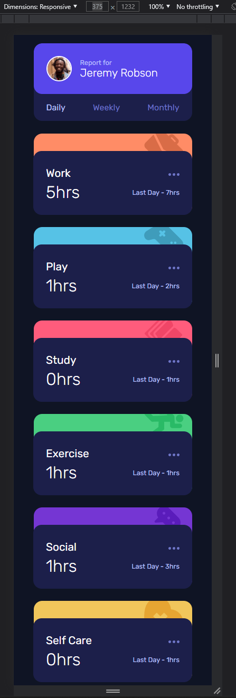
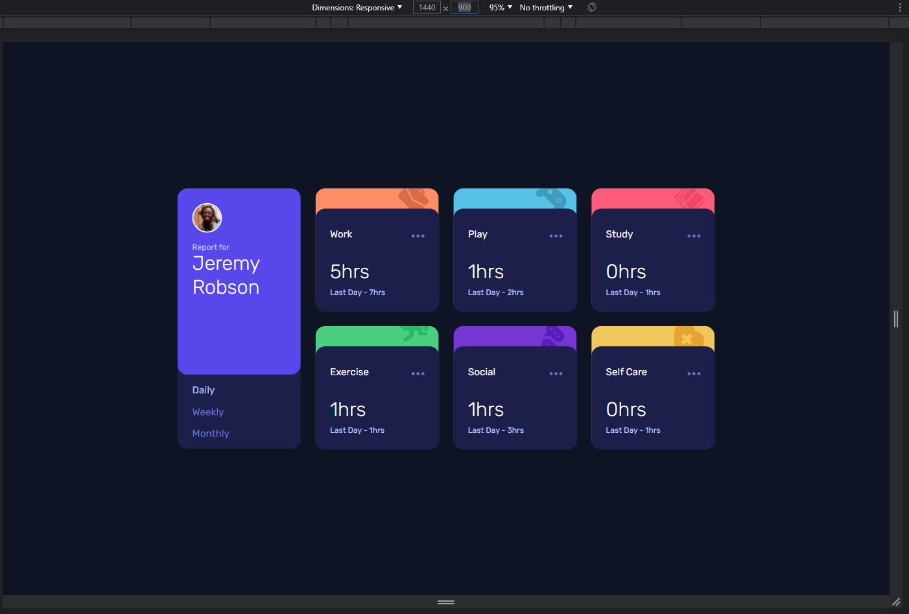

# Frontend Mentor - Time tracking dashboard solution

This is a solution to the [Time tracking dashboard challenge](https://www.frontendmentor.io/challenges/time-tracking-dashboard-UIQ7167Jw) from [Frontend Mentor](https://www.frontendmentor.io). Frontend Mentor challenges help you improve your coding skills by building realistic projects.

## Table of contents

- [Overview](#overview)
  - [The challenge](#the-challenge)
  - [Screenshots](#screenshots)
  - [Links](#links)
- [Check it out](#check-it-out)
  - [Live demo](#live-demo)
  - [Explore the code](#explore-the-code)
    - [Get the repo](#get-the-repo)
    - [Install and run](#install-and-run)
- [Tech stack](#tech-stack)

## Overview

The starter code contained a style guide, image assets (designs and image resources), and a data.json object with the necessary data.

### The challenge

The challenge is to build out this dashboard and get it looking as close to the design as possible.

Users should be able to:

- View the optimal layout for the site depending on their device's screen size
- See hover states for all interactive elements on the page
- Switch between viewing Daily, Weekly, and Monthly stats

### Screenshots




## Check it out

### Live demo

Head to XXXXXXXXXXXX to play around with the latest production deployment.

### See the code

Explore the code here or on your machine.

#### Get the repo

Clone the code:

```
git clone https://github.com/nosthrillz/carty.git
cd carty
```

#### Install and run

Make sure you have npm installed, then run the following command inside the project folder:

```
npm i && npm start
```

## Tech stack

Tech stack laundry list:

*   HTML
*   CSS / SASS
*   React.js
